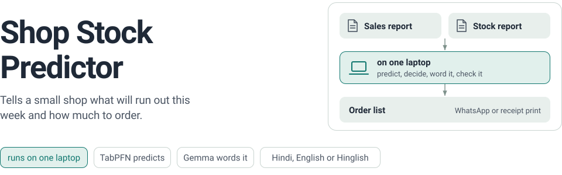
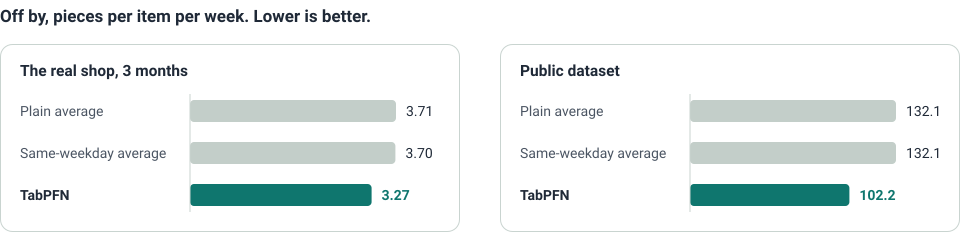

<p align="center">
  <picture>
    <source media="(prefers-color-scheme: dark)" srcset="docs/assets/hero-dark.svg">
    <source media="(prefers-color-scheme: light)" srcset="docs/assets/hero-light.svg">
    
  </picture>
</p>

Built for a friend's father, who runs an electrical shop and decides what to reorder by walking the
shelves. He uploads the two reports his billing app already makes, and gets back a short note in
Hindi, English or Hinglish and an order list to send on WhatsApp or print on a receipt printer.

Made for the DEV [Hacktoberfest Weekend Challenge: Build for a Friend](https://dev.to/challenges/hacktoberfest-weekend-2026-10-01).

## Quickstart

```sh
python -m venv .venv
.venv/bin/pip install -r requirements.txt
ollama pull gemma3:4b
.venv/bin/streamlit run app.py
```

Needs Python 3.12, [Ollama](https://ollama.com) and `pdftotext` (`poppler-utils` on Linux). Open
the page and switch on "Try it with sample data", or upload your own two reports.

## How it works

<p align="center">
  <picture>
    <source media="(prefers-color-scheme: dark)" srcset="docs/assets/flow-dark.svg">
    <source media="(prefers-color-scheme: light)" srcset="docs/assets/flow-light.svg">
    
  </picture>
</p>

The two files are read with ordinary parsers. [TabPFN](https://github.com/PriorLabs/TabPFN), an
open model for tables, guesses each item's sales for the next 7 days. Plain arithmetic turns that
into what runs out, on which day, and how many packs to order.
[Gemma](https://ai.google.dev/gemma), run locally with Ollama, only rewords each finished line.

## The AI never touches the numbers

- TabPFN only guesses sales. It never decides a quantity to order.
- Gemma never sees an item name or a number. It gets `[ITEM]` and `[QTY]` slots, and code puts
  the real values back.
- Code checks every line Gemma writes. A line that fails is replaced by the plain sentence.

## Does it help?

<p align="center">
  <picture>
    <source media="(prefers-color-scheme: dark)" srcset="docs/assets/results-dark.svg">
    <source media="(prefers-color-scheme: light)" srcset="docs/assets/results-light.svg">
    
  </picture>
</p>

The app hides weeks of real sales, predicts them, and compares TabPFN with two averages that need
no AI. On three months of the real shop, TabPFN was closer per day in all six hidden weeks and per
week in five of six. On the public dataset
([Online Retail II](https://archive.ics.uci.edu/dataset/502/online+retail+ii)) it was closer in all
six. With only one month of bills it was a toss-up.

A first version that put every item in one table lost to the plain average. This one follows Prior
Labs' recipe ([TabPFN-TS](https://arxiv.org/abs/2501.02945)): one small table per item, with only
calendar features.

## Limits

- The "busy week" number is meant to cover about 8 weeks in 10. On the real shop it covered 66
  percent of items, so slow sellers can be under-ordered.
- Scanned, photographed or handwritten bills are not read, and the bill-wise PDF layout it knows is
  from one billing app.
- Items sold on fewer than 3 days are set aside as too rare to predict, and a sudden bulk sale
  cannot be predicted.
- Receipt printing is Linux only (BlueZ with `Experimental = true`), tried on one 2 inch PSF588
  printer.
