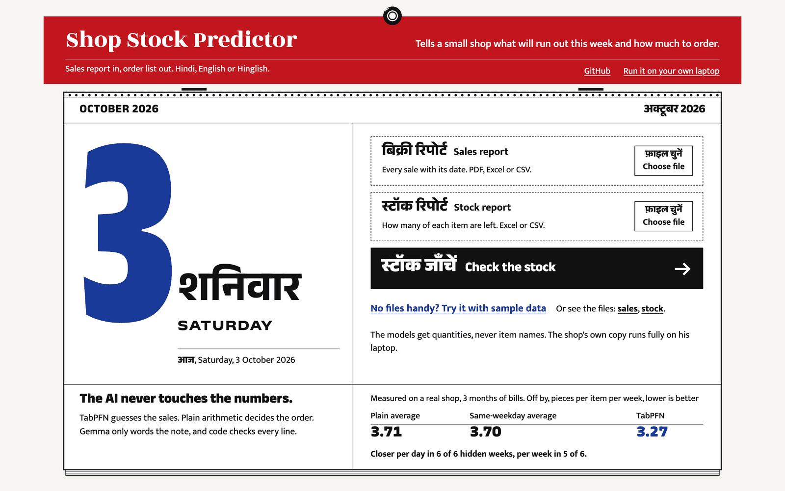
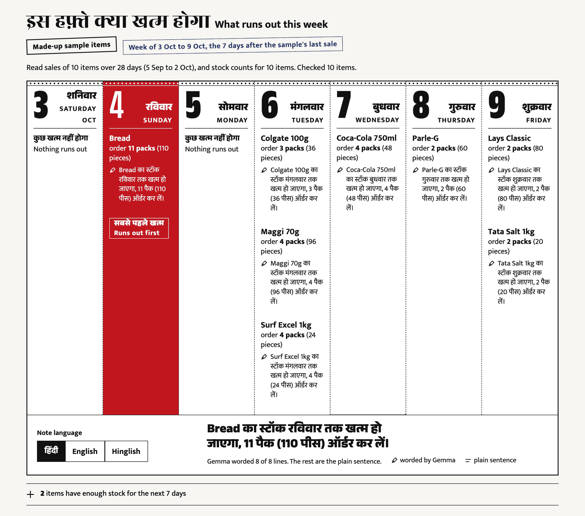
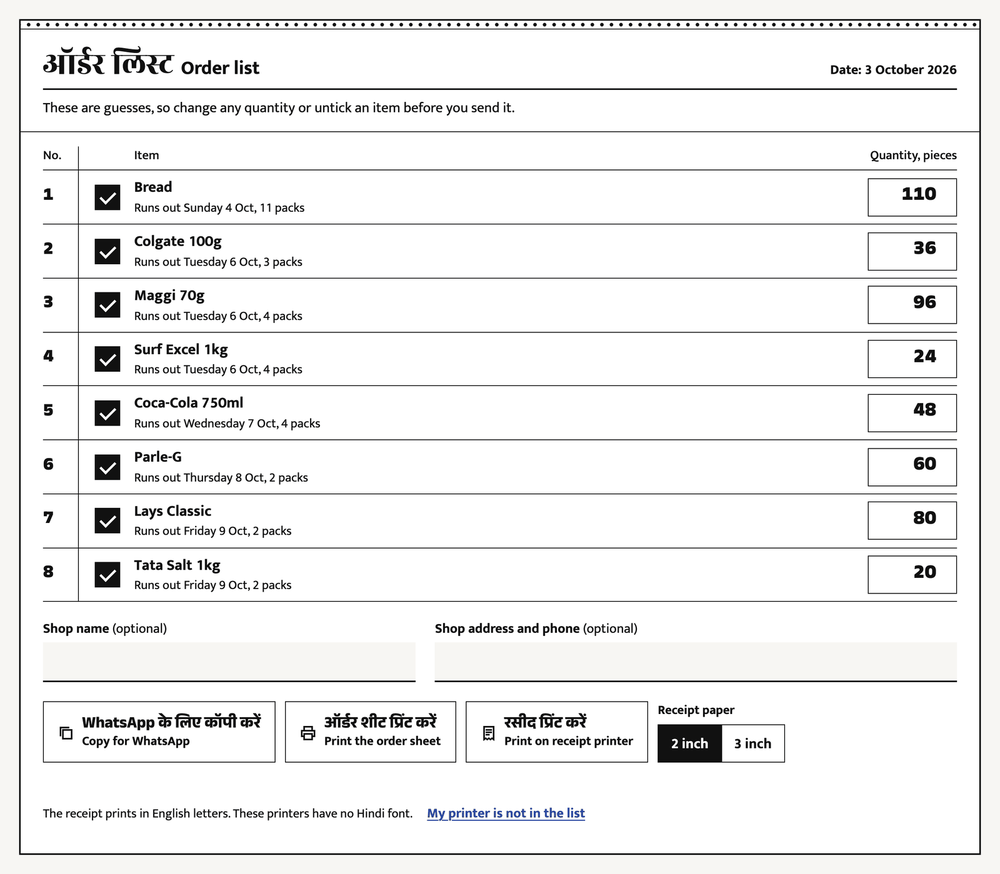
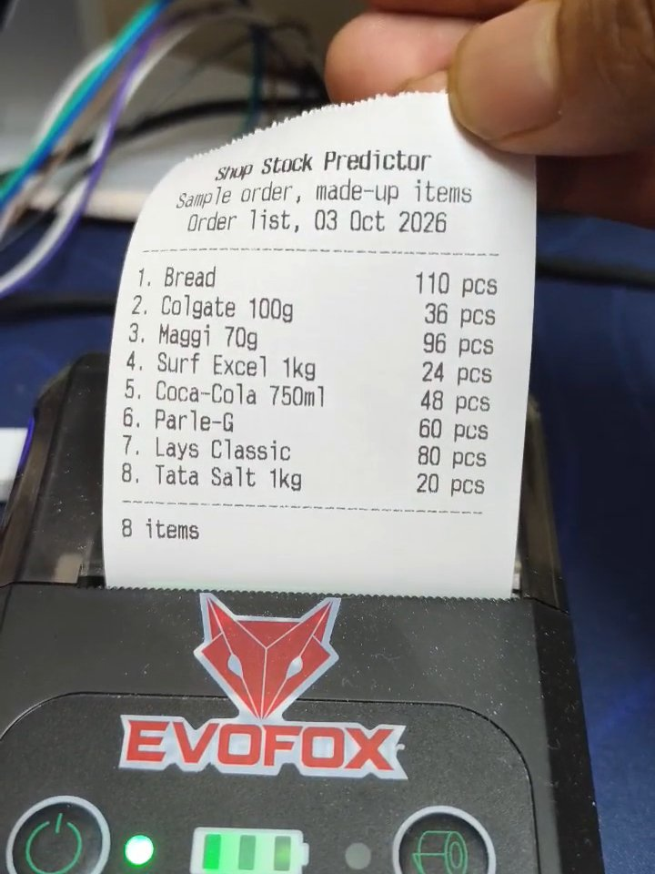
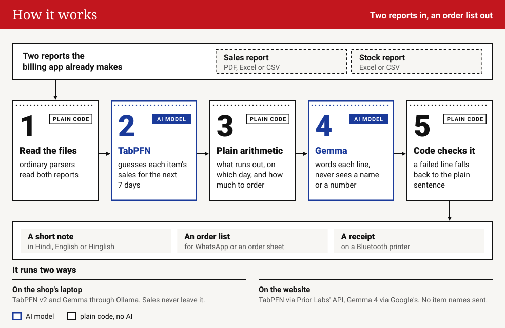
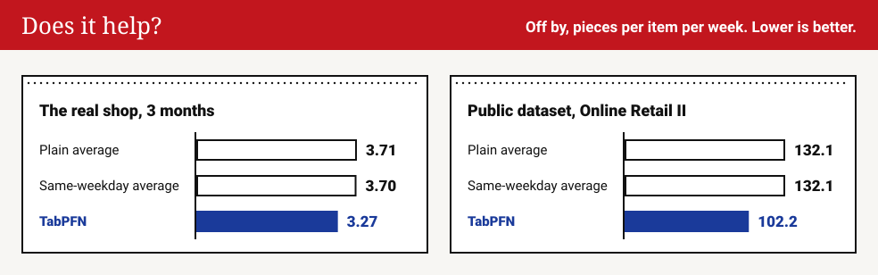

# Shop Stock Predictor

Tells a small shop what will run out this week and how much to order.

<p align="center">
  
</p>

Built for a friend's father, who runs an electrical shop and decides what to reorder by walking
the shelves. He gives it the two reports his billing app already makes. He gets back a short note
in Hindi, English or Hinglish and an order list to send on WhatsApp or print.

<p align="center">
  <a href="https://shop-stock-predictor.onrender.com">Try it live</a> ·
  <a href="https://shop-stock-predictor.onrender.com/media/demo.mp4">Watch the one-minute video</a> ·
  Made for the DEV <a href="https://dev.to/challenges/hacktoberfest-weekend-2026-10-01">Hacktoberfest Weekend Challenge: Build for a Friend</a>
  <br><sub>The free host sleeps when idle, so the first visit can take about a minute.</sub>
</p>

<p align="center">
  
</p>

## What it does

<table>
  <tr>
    <td width="33%" align="center" valign="top"><br>Each item lands on the day it runs out.</td>
    <td width="33%" align="center" valign="top"><br>Change any quantity, then send or print the order.</td>
    <td width="33%" align="center" valign="top"><br>A receipt from the browser, on a Bluetooth printer.</td>
  </tr>
</table>

## How it works

<p align="center">
  
</p>

[TabPFN](https://github.com/PriorLabs/TabPFN), an open model for tables, guesses each item's
sales for the next 7 days. Plain arithmetic turns that into what runs out, on which day, and how
many packs to order. [Gemma](https://ai.google.dev/gemma) only rewords each finished line.
On the shop's laptop both models run locally (TabPFN v2, and Gemma through Ollama) and the sales
never leave it. The website's small free host cannot hold the models, so it calls TabPFN through
Prior Labs' API and Gemma 4 through Google's API, and item names go to neither.

## The AI never touches the numbers

- TabPFN only guesses sales. It never decides a quantity to order.
- Gemma never sees an item name or a number. It gets `[ITEM]` and `[QTY]` slots, and code puts
  the real values back.
- Code checks every line Gemma writes. A line that fails is replaced by the plain sentence.

## Does it help?

<p align="center">
  
</p>

The app hides weeks of real sales, predicts them, and compares TabPFN with two averages that need
no AI. On three months of the real shop, TabPFN was closer per day in six of six hidden weeks and
per week in five of six. On the public dataset
([Online Retail II](https://archive.ics.uci.edu/dataset/502/online+retail+ii)) it was closer in
six of six. With only one month of bills it was a toss-up.

A first version that put every item in one table lost to the plain average. This one follows
Prior Labs' recipe ([TabPFN-TS](https://arxiv.org/abs/2501.02945)): one small table per item,
with only calendar features.

## Use it

Online: open the site and press "Try it with sample data", or upload your own two reports.
On your own laptop:

```sh
python -m venv .venv
.venv/bin/pip install -r requirements.txt
ollama pull gemma3:4b
.venv/bin/streamlit run app.py
```

Needs Python 3.12, [Ollama](https://ollama.com) and `pdftotext` (`poppler-utils` on Linux).

## Limits

- The "busy week" number is meant to cover about 8 weeks in 10. On the real shop it covered 66
  percent of items, so slow sellers can be under-ordered.
- Scanned, photographed or handwritten bills are not read, and the bill-wise PDF layout it knows is
  from one billing app.
- Items sold on fewer than 3 days are set aside as too rare to predict, and a sudden bulk sale
  cannot be predicted.
- Receipt printing from the website needs Chrome or Edge on Android or a computer, not iPhone,
  Safari or Firefox. The laptop version prints on Linux only (BlueZ with `Experimental = true`).
  Both were tested on one 2 inch PSF588 printer, and receipts print in English letters only.
- The website checks at most 40 items per run and files up to 5 MB, keeps nothing on disk and
  forgets results after 30 minutes.
